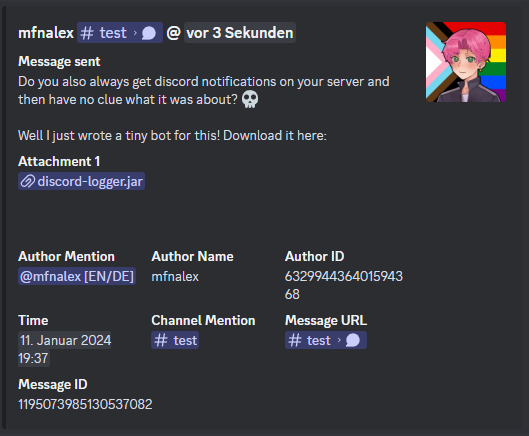

Simple Discord bot to log a server's messages to a channel. This is useful if you have lots of channels and never know where a message came from when you hear the annoying discord notification sound.



## Building
```bash
./gradlew build
```

## Running
Run the .jar using Java 8 or newer and specify your bot token and the channel id you want to log to.
```bash
java -jar discord-logger.jar -b <bot-token> -c <channel-id>
```